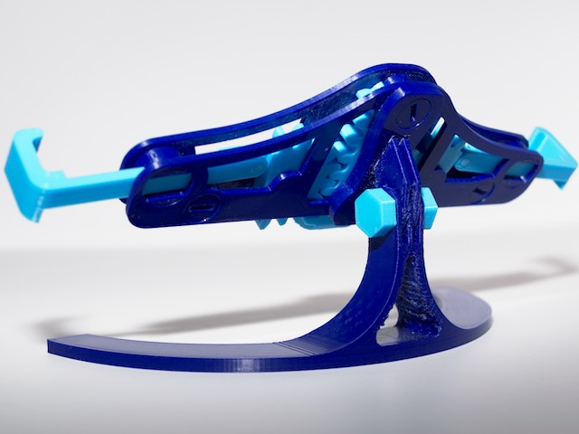

Lowrider Mod for Mechanical Phone Stand
===

Description 
---
Remix of the upper mounting components on the [Mechanical Quick Grab Stand](https://www.thingiverse.com/thing:3681512).  
Allows for elimination of the long gantry making for a narrower less vibration prone footprint. 

|  | 
| --- | --- | 

### Changes
* Reduced the original mount to two tabs  
	*prevents needing to use the original three tab offset to one side*
* Added an angle to the mount  
	*provides a default can't upwards and transfers force downward when inserting phone making it less likely to pivot*

#### Modified Parts Shown in Red

Credits
---
[Original Mechanical Quick Grab Phone Stand](https://www.thingiverse.com/thing:3681512)

Print Settings
---
| Print Setting | Value |
| --- | --- |
| Material | PLA |
| Layer Height | 0.2mm |
| Supports | probably |

Appendix
---
Original phone stand provided as published in .zip.
